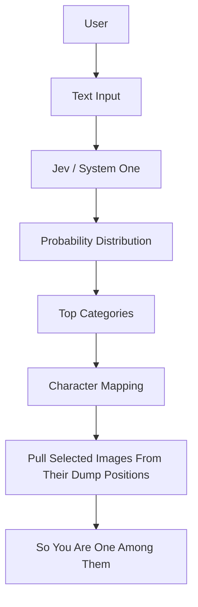

# You Are 1 Among Them

## Product Brief

This document describes the product concept, interaction model, visual direction, and initial character data for **You Are 1 Among Them**.

> A playful creative experience, not a psychological diagnosis or serious personality assessment.

## Concept

The user describes how they feel, what they are thinking, or the kind of state they are currently in. **Jev / System One** classifies that text against a predefined set of emotional and archetypal categories.

The highest-probability categories determine which fictional, movie, or public characters are shown.

The intended experience is:

> **User describes themselves -> Jev interprets the state -> matching characters are physically pulled out of a chaotic character dump -> "So you are one among them..."**

## UI Layout

### 1. Main Heading

Display the following at the top of the page:

> **You are 1 among them**

Use a handwritten, playful visual style.

### 2. Input

Place a large, centered text input below the heading.

- Support natural free-form text.
- Let the user describe a feeling, thought, mood, or imagined state.
- Use this placeholder example:

        `i feel like doing mischievous things with time`

### 3. Result Text

Display the result label below the input:

> **So you are one among them....**

It may remain hidden until the user submits their description.

### 4. Character Dump

The bottom portion of the screen contains a large, chaotic collection of character images. This is intentionally **not a gallery**. It should feel like a dump or pile of possibilities.

#### Composition Requirements

- Random positions
- Random rotations
- Different image sizes
- Slight overlaps
- Some images partially covering others
- No grid
- No cards
- No organized rows
- No obvious ordering
- An organic, playful composition

The exact arrangement should be randomized, but it must remain readable and usable.

Example composition:

```text
                                [character]

 [character]    [character]
                 [character]
                                                 [character] [character]

 [character] [character]     [character]
                         [character]    [character]
```

## Data Model

### Character

Each character should follow a structure similar to:

```json
{
        "id": "loki",
        "name": "Loki",
        "image": "/characters/loki.png",
        "archetypes": [
                "time_manipulator",
                "mischievous",
                "chaotic"
        ]
}
```

Characters must be mapped to predefined archetypes or categories.

### Archetype

Define the available categories in the application before sending any request to Jev.

```json
{
        "id": "time_manipulator",
        "description": "Someone fascinated by controlling or manipulating time"
}
```

Initial category ideas:

| Category | Category | Category | Category |
| --- | --- | --- | --- |
| `mischievous` | `chaotic` | `lonely` | `overconfident` |
| `heroic` | `revenge_driven` | `romantic` | `philosophical` |
| `power_hungry` | `adventurous` | `reality_manipulator` | `time_manipulator` |
| `genius` | `antihero` |  |  |

The category set can be expanded later.

## Jev / System One Logic

Jev must classify the user's input against the application's predefined categories. It must **not** invent new categories.

### Classification Flow

```text
User input
                |
                v
Jev / System One
                |
                v
Predefined categories
                |
                v
Probability for each category
                |
                v
Select the highest-probability relevant categories
                |
                v
Find characters mapped to those categories
```

### Example Classification

**User input**

> "I feel like I can control timelines and jump between universes."

**Jev output**

| Category | Probability |
| --- | ---: |
| `time_manipulator` | 0.91 |
| `reality_manipulator` | 0.87 |
| `chaotic` | 0.64 |
| `power_hungry` | 0.52 |
| `adventurous` | 0.41 |

Take the top relevant categories and retrieve their mapped characters.

### Tone Constraint

The system should **not** say:

> "You are Loki."

Instead, communicate:

> **So you are one among them....**

The user should feel that they resemble an archetype, not that the system has literally identified them as a fictional character.

## Animation

The extraction animation is one of the most important parts of the experience.

### Submission Sequence

1. The user submits their description.
2. Wait for a tiny pause.
3. Jev evaluates the input.
4. Matching characters are identified.
5. Matching images are pulled out of the dump.
6. The images travel toward the result area.
7. The images settle into their final positions.

### Pull-Out Behavior

Selected images must originate from their actual current positions in the dump. Do **not** simply fade five new images into the result area.

Before submission:

```text
                                                                                [Loki]

 [Batman]       [Dr Strange]
                         [Spider-Man]       [Thor]

                                                 [Wanda]
```

After submission:

```text
                                                                                |
                                                        [Loki] +------+
                                                                                                                        v
 [Batman]       [Dr Strange] ---> RESULT AREA
                         [Spider-Man]
                                                 [Wanda] --------->
```

The selected images should physically move from the dump toward the result area. This creates the feeling that relevant characters are being pulled out of a huge pool of possibilities.

### Animation Style

The movement should be:

- Smooth
- Slightly playful
- Organic
- Not robotic
- Not too fast
- Slightly springy when the images reach the result area

Non-selected images must remain untouched. Do **not** rearrange the entire dump after every query.

## Result Characters

- Show approximately five selected characters.
- Place them below **So you are one among them....**
- Do not arrange them as a traditional card grid.
- Let them retain the playful visual language of the dump while making them more visually prominent.

## Visual Direction

### The UI Should Feel

- Experimental
- Playful
- Hand-drawn
- Slightly chaotic
- Minimal
- Interactive
- Meme-like

### Avoid

- Corporate dashboard aesthetics
- Standard card grids
- Conventional recommendation UI
- Excessive text
- Heavy borders everywhere
- Generic AI chatbot styling

The chaotic character dump and physical extraction animation are the main visual identity of the project.

## Core Architecture



## Key Principle

Characters should feel as though they were already present, hidden among thousands of possibilities, and the user's description causes the relevant ones to be pulled out.

That interaction is the heart of the project.

## Initial Character Set

| Character | Archetype / State |
| --- | --- |
| **Nobita** | Lazy, helpless, unlucky, escapist, wants someone to save the situation |
| **Naruto** | Determined, energetic, ambitious, loyal, refuses to give up |
| **Spider-Man** | Playful responsibility, witty, overwhelmed but keeps going, wants to help |
| **Salman Khan** | Unbothered confidence, swagger, protective, larger-than-life |
| **Dhurandhar** | Calculated, intense, strategic, undercover, high-stakes mindset |
| **Ajit Doval** | Strategic, composed, calculated, intelligence-oriented |
| **Elon Musk** | Ambitious, futuristic, unconventional, obsessed with changing or building things |
| **IShowSpeed** | Hyperactive, chaotic, impulsive, extremely expressive |
| **Loki** | Mischievous, unpredictable, manipulative, playful chaos, power-seeking |
| **SRK** | Romantic, charismatic, dramatic, emotionally intense, charming |
| **Max Verstappen** | Competitive, focused, aggressive, goal-oriented, hates losing |
| **GOAT-mamu** | Absurd confidence, meme energy, unserious, unpredictable |
| **Uzair Baloch** | Dark, intimidating, power-driven, ruthless, territorial |
| **Mufasa** | Calm authority, protective, wise, responsible, leadership |
| **Rajinikanth** | Mass confidence, effortless dominance, larger-than-life swagger |
| **PR / "when he comes let's play dude music"** | Chaotic entrance energy, hype, instantly changes the atmosphere |
| **Sakura** | Determined, emotionally expressive, competitive, protective, resilient |
| **Lewis Hamilton** | Driven, composed, competitive, stylish, ambitious, resilient |
                      ▼
